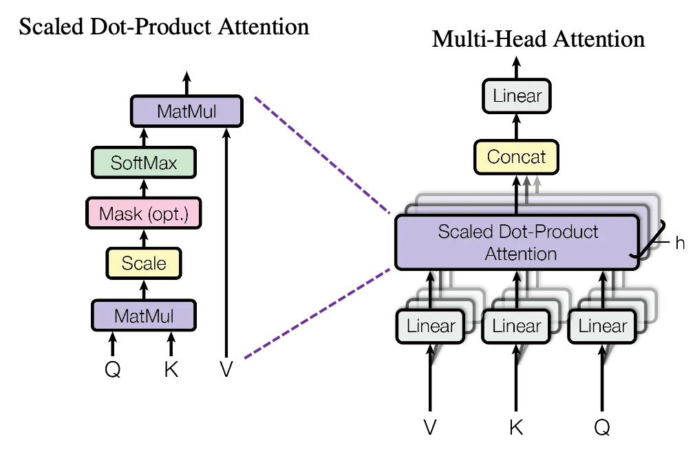

  

<h1 align="center">Exploring the Effectiveness of Self-Attention and Vision Transformer for Lung Ultrasound Image Classification </h1>

  

<!-- # 📝 Table of Contents
<!-- - [📋 About ](#about-)
- [✍️ Authors ](#️-authors-)
- [🎉 Acknowledgements ](#-acknowledgements-) -->

<!-- # 📋About  --> -->

# ✍️ Author 
- Melnic Andrian [@andrian-melnic](https://github.com/andrian-melnic)
<!-- 
# 🎉 Acknowledgements 
- Advanced Cybersecurity for IT - Professor <a href="https://www.dii.univpm.it/luca.spalazzi"> <i>Luca Spalazzi</i></a> -->
